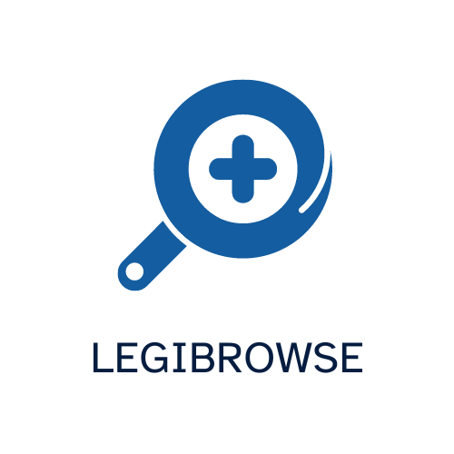

# LegiBrowse



[](https://chromewebstore.google.com/detail/legibrowse/ildkgfaaplpfoaiekfmajbemjadppjne)[](https://microsoftedge.microsoft.com/addons/detail/legibrowse/glplkehkcnfchhdnjcebeghnkabmefgo)

Do you find certain web fonts are hard to read or strain your eyes while browsing? LegiBrowse is designed to improve your online reading experience by automatically replacing all fonts on a webpage with the highly legible Atkinson Hyperlegible font.

Why use LegiBrowse?
- Easily turn font replacement on and off from a simple popup
- Improved readability: The Atkinson Hyperlegible font is designed with enhanced letter differentiation, perfect for users with visual impairments or anyone seeking a clearer, more accessible reading experience.
- Consistent text clarity: Enjoy uniform, easy-to-read text across all websites, making browsing less tiring and more comfortable.
- Simple and automatic: LegiBrowse works seamlessly in the background, ensuring your preferred font is applied without any hassle.

## Development

LegiBrowse uses the [WXT web extension framework](https://wxt.dev/). It can be built for Chromium web browsers.

[Install pnpm before continuing.](https://pnpm.io/)

Clone this repository, and then open a terminal inside its directory.

Run this command to build the extension and run the development server locally. Your web browser will open with LegiBrowse installed automatically. Changes will be detected and the extension rebuilt as you save files in this directory.

```
pnpm dev
```

To build a bundle for distribution, run the following replacing <browser> with one of chrome or edge depending on your intended target:

```
pnpm wxt build -b <browser>
pnpm wxt zip -b <browser>
```

Your bundle, ready for the extension stores or for manual installation, will be available in the `.output` directory.

## Attribution

**LegiBrowse** uses the [Atkinson Hyperlegible](https://brailleinstitute.org/freefont) font developed by the Braille Institute, which is licensed under the [SIL Open Font License, Version 1.1](https://scripts.sil.org/cms/scripts/page.php?item_id=OFL_web).